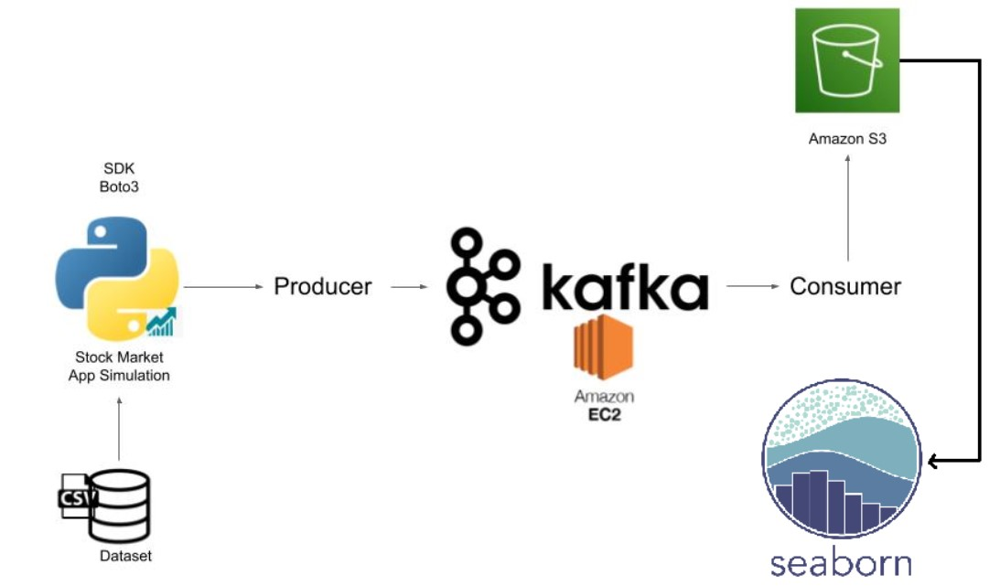

# Stock Market Kafka Real Time Data Engineering Project

## Introduction 
Este proyecto de Ingenieria de Datos End-To-End consiste en trabajar con datos bursátiles en tiempo real usando como herramienta principal Apache Kafka.

Los datos en tiempo real serán simulados a través de un script de Python que toma datos aleatorios de un archivo CSV que contiene datos de índices bursátiles, los cuales son enviados mediante un Producer a Kafka y obtenidos mediante un Consumer que se encargara de enviar posteriormente estos datos a  Amazon S3 donde son almacenados para su graficación mediante una línea del tiempo con Seaborn.

## Arquitectura original


## Tecnologia utilizada
- Lenguaje de programación - Python
- Amazon Web Service (AWS)
    1. EC2
    2. S3 (Simple Storage Service)
    3. IAM (Identity and Access Management)
- Apache Kafka
- Seaborn

## Video tutorial usado como base.

Link - https://youtu.be/KerNf0NANMo

## Dependencias a instalar

Utilizar `pip install` para instalar las siguientes librerias de python:

- kafka-python
- s3fs
- pandas
- seaborn

## Configuración del entorno.

### Montar servicios AWS

Crear instancia `EC2`, bucket en `S3` y usuario administrador en `IAM` con apoyo del video tutorial.

### Instalar y configurar Apache Kafka

Seguir los pasos del archivo `command_kafka.txt` que tiene los comandos actualizados para realizar la instalacion y configuración de Apache Kafka.

### Instalar AWS CLI

Instalar AWS CLI (https://aws.amazon.com/es/cli/) y realizar la configuracion del usuario utilizando el `Access key ID` y `Secret access key` proporcionados cuando se creo el usuario administrador con IAM. 

Esto servira para poder conectarnos a S3 desde Jupyter.

### Llenar valores sensibles

En el archivo `secret_values` establecer el valor para la constante `EC2_PUBLIC_IP` que representa la IP pública de la instancia EC2.

## Ejecutar el proyecto

### Ejecutar Zoo-keeper

Abrir una nueva consola, conectarse a EC2 mediante SSH y ejecutar los siguientes comandos.

```
cd kafka_2.12-3.3.1/
bin/zookeeper-server-start.sh config/zookeeper.properties
```

### Ejecutar Kafka-server

Abrir una nueva consola, conectarse a EC2 mediante SSH y ejecutar los siguientes comandos.

```
cd kafka_2.12-3.3.1/
export KAFKA_HEAP_OPTS="-Xmx256M -Xms128M"
bin/kafka-server-start.sh config/server.properties
```

### Kafka consumer

Ejecutar todas las celdas de la libreta `KafkaConsumer`, la cual entrara en espera de recibir datos para luego subirlos al bucket en S3.

### Kafka producer

Ejecutar todas las celdas de la libreta `KafkaProducer`, la cual empezará a enviar datos aleatorios a partir del archivo `indexProcessed.csv`.

### Dashboard

Ejecutar todas las celdas de la libreta `Dashboard`, que cada segundo estara actualizando la linea del tiempo con los valores nuevos de S3 del cierre del índice bursatil.